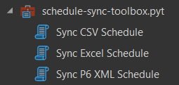
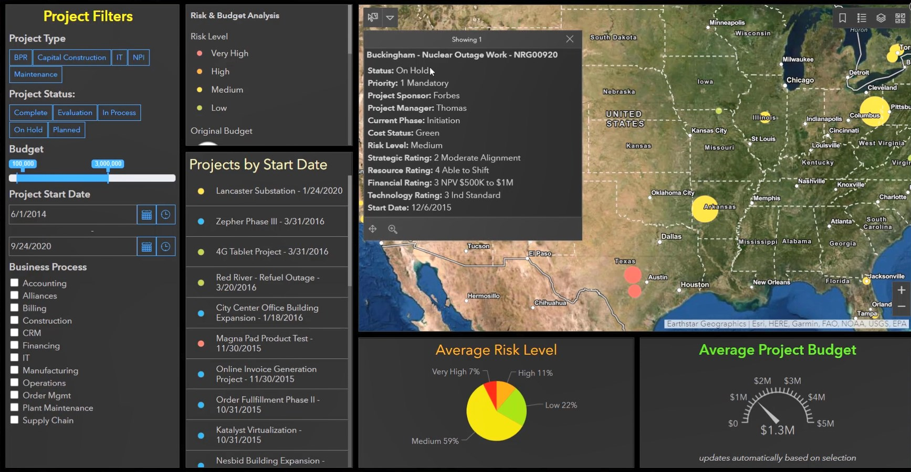
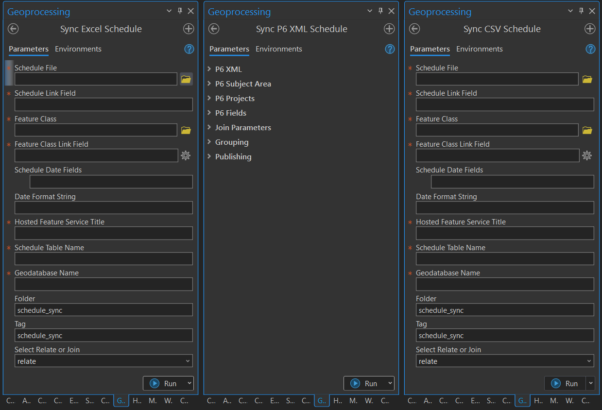

# schedule-sync

Schedules are inherently spatial. However, schedules often do not contain a spatial component. In addition, schedules are continually changing and time specific. The schedule-sync repository gives you a series of workflows to sync your schedule data to your ArcGIS Enterprise or ArcGIS Online account. The workflows are powered by a set of ArcGIS Pro tools. 

Using the schedule sync workflows you will now be able to plainly see the spatial nature of your schedule. By running these automated workflows you can automatically keep your published schedule data up-to-date. Date datatypes are preserved so your published layers can be time-enabled allowing all the Esri time-enabled functionality. 

Here we provide three ArcGIS Pro tools, one for each of three data sources. The best workflow for you will depend on the source of your schedule data. Inside the schedule-sync-toolbox you will find the following tools:

1. Sync CSV Schedule
1. Sync Excel Schedule
1. Sync P6 XML Schedule

You can find example workflows with test data for all three tools in the [example-workflows](example-workflows) directory.

## Features

**Features of all tools**

* Interactive and automation friendly ArcGIS Pro Tool
* Creation of relationship class or join between the schedule table and a feature class using configurable link fields.
* Publishing of a new feature service with the schedule table, and feature service with a relationship class or join. 
* Updating of a feature service with a schedule table, feature service, and relationship class.
* Autodetection of existing feature service. If the feature service does not exist, we publish, otherwise we update.

**Sync Excel Schedule Tool Features**

* Support for reading Excel schedule files and creation of a schedule feature table. It is assumed the schedule is in the first worksheet. See the example [activities.xlsx](./data/activities.xlsx) for a template to follow.
* Support for pulling the field names from the worksheet. The field names must be provided on the first row of the worksheet.
* Support for the input of display-friendly, alias field names. The alias names must be provided on the second row of the worksheet.

**Sync CSV Schedule Tool Features**

* Support for reading CSV schedule files and creation of a schedule feature table. See the example [activities.csv](./data/activities.csv) for a template to follow.
* Support for pulling the field names from the CSV file. The field names must be provided on the first row.
* Support for the input of display-friendly, alias field names. The alias names must be provided on the second row.

**Sync P6 XML Schedule Tool Features**

* Support using data Oracle P6 XML files. P6 XML files can be exported from Primavera Cloud, Primavera P6 EPPM Servers, and Primavera P6 Professional.
* Supports the creation of schedule tables from the P6 Project, Activity, and WBS subject areas.
* Supports the joining of the schedule table and a feature class. The join is best when you have a one-to-one type join. 
* Supports the creations of a relationship class between the schedule table and feature class. The relationship is best when you do not have a one-to-one relationship.
* Supports grouping date columns. When grouping is applied using a source schedule column, two new columns are added to the feature class: one for the earliest associated date and another for the latest associated date. Grouping by date is an important workflow when we want to time-enable a feature class.
* Supports grouping by classification columns. When grouping is applied using a source classification column a new column is added to the feature class for every unique value that exists in the specified column. Under each column the value will specify if the feature has any linked table row with the column category. Grouping by classification is an important workflow when we want to symbolize by a categories. 

## Instructions

Instructions are provided for each of the tools.

### Sync CSV Schedule Instructions

You can find an example workflow using this tool in [example-workflows/Sync CSV Schedule Workflow](example-workflows/Sync CSV Schedule Workflow)

#### CSV Schedule and Feature Class Data Preparation

We have two imporant inputs to our tool. First, we have the CSV schedule file. Second, we have an Esri feature class, which contains our spatial geometry such as points, polylines, or polygons. 

1. Give each feature class feature a unique ID. Let us call this our `geo_id`. Add a text column to your feature class and popuplate all rows. No two rows can have the same value, otherwise we will not be able to differentiate between those two features. 
2. Add a text column to your schedule. For each item in your scedule specifiy one `geo_id`. The `geo_id` will be the value that links our schedule to our features. 
3. Export or save your schedule data to a CSV file. The first row of the file must be the field names. The second row must be the field alias names. The values start on the third row. Make note of the file path location. You will be providing the CSV file location as one of the tool inputs.
4. Take note of any datetime fields. You have the option to import these fields as the Esri datetime datatype. To do the conversion you must provide the datetime source format using the Python datetime format string convention. See the documentation about creating your Python datetime format string [here](https://docs.python.org/3/library/datetime.html). Make note of your optional format string to use as one of the tool inputs.

#### Sync CSV Schedule Tool Inputs

**Schedule File:** Provide the path to your CSV file. Use the file browser to select your CSV schedule file. The first row of values in the file will be used as the field names. The field name values must follow all the standard requirements for geodatabase table field names. The second row of the values in the file will be used as the alias names. The alias names must follow all the standard requirements for Table alias names.

**Schedule Link Field:** Select the field in your schedule used to link the schedule table to the feature class feature. 

**Feature Class:** Provide the path to your feature class.

**Feature Class Link Field:** Select the field in your feature class used to link the schedule table to the feature class feature. 

**Schedule Date Fields:** Select the fields you would like to be the Esri datetime datatype. 

**Date Format String:** Provide the datetime format string for any date fields. See the Python documentation on datetime formatting strings [here](https://docs.python.org/3/library/datetime.html).

**Hosted Feature Service Title:** Provide the title for the feature service to be published to your ArcGIS Enterprise or ArcGIS Online organization.

**Schedule Table Name:** Provide the name to be used for your published table. The name must follow the conventions for a geodatabase table name. 

**Geodatabase Name:** Provide the name to be used for your published geodatabase. The name must follow the conventions for a geodatabase name.

**Folder:** Provide the folder where the published content will be published to or updated in. 

**Tag:** Provide the tag used to label the published content.

**Select Relate or Join:** Choose the relate or join option for the published content. Join is used when you have one schedule row for each one feature. More commonly people use the relate option, which is used for all other situations.  

#### Using the Sync CSV Schedule Tool

1. Clone the repo to a local directory accessible by ArcGIS Pro.
2. Open ArcGIS Pro.
3. Sign into your ArcGIS Enterprise or ArcGIS Online organization. See documentation [here](https://pro.arcgis.com/en/pro-app/latest/help/projects/sign-in-to-your-organization.htm).
4. Open the `schedule-sync-toolbox.pyt` in ArcGIS Pro. See documentation [here](https://pro.arcgis.com/en/pro-app/latest/help/projects/connect-to-a-toolbox.htm).
5. Open the Sync CSV Schedule tool.
6. Populate the tool input values and run the tool. You can also use ArcGIS Pro to schedule the running of the tool to automate your update process. See the documentation on tool scheduling [here](https://pro.arcgis.com/en/pro-app/latest/help/analysis/geoprocessing/basics/schedule-geoprocessing-tools.htm).

### Sync Excel Schedule Instructions

You can find an example workflow using this tool in [example-workflows/Sync Excel Schedule Workflow](example-workflows/Sync Excel Schedule Workflow)

#### Excel Schedule and Feature Class Data Preparation

We have two imporant inputs to our tool. First, we have the Excel schedule file. Second, we have an Esri feature class, which contains our spatial geometry such as points, polylines, or polygons. 

1. Give each feature class feature a unique ID. Let us call this our `geo_id`. Add a text column to your feature class and popuplate all rows. No two rows can have the same value, otherwise we will not be able to differentiate between those two features. 
2. Add a text column to your schedule. For each item in your scedule specifiy one `geo_id`. The `geo_id` will be the value that links our schedule to our features. 
3. Export or save your schedule data to an Excel file. The schedule must be on the first worksheet. The first row of the file must be the field names. The second row must be the field alias names. The values start on the third row. Make note of the file path location. You will be providing the Excel file location as one of the tool inputs.
4. Take note of any datetime fields. You have the option to import these fields as the Esri datetime datatype. To do the conversion you must provide the datetime source format using the Python datetime format string convention. Please note Excel will display a date format different from the data saved to the Excel file. You must provide the format of the date saved to the Excel file. One solution is to convert your Excel date columns to text columns so you can see and control the actual date format. [See the documentation about creating your Python datetime format string here](https://docs.python.org/3/library/datetime.html). Make note of your optional format string to use as one of the tool inputs.

#### Sync Excel Schedule Tool Inputs

**Schedule File:** Provide the path to your Excel file. Use the file browser to select your Excel schedule file. The first row of values in the file will be used as the field names. The field name values must follow all the standard requirements for a geodatabase table field name. The second row of the values in the file will be used as the alias names. The alias names must follow all the standard requirements for Table alias names.

**Schedule Link Field:** Select the field in your schedule used to link the schedule table to the feature class feature. 

**Feature Class:** Provide the path to your feature class.

**Feature Class Link Field:** Select the field in your feature class used to link the schedule table to the feature class feature. 

**Schedule Date Fields:** Select the fields you would like to be the Esri datetime datatype. No input is required if you do not want to make this conversion.

**Date Format String:** Provide the datetime format string for any date fields. See the Python documentation on datetime formatting strings [here](https://docs.python.org/3/library/datetime.html). No input is required if you do not want to make this conversion.

**Hosted Feature Service Title:** Provide the title for the feature service to be published to your ArcGIS Enterprise or ArcGIS Online organization.

**Schedule Table Name:** Provide the name to be used for your published table. The name must follow the conventions for a geodatabase table name. 

**Geodatabase Name:** Provide the name to be used for your published geodatabase. The name must follow the conventions for a geodatabase name.

**Folder:** Provide the folder where the published content will be published to or updated in. 

**Tag:** Provide the tag used to label the published content.

**Select Relate or Join:** Choose the relate or join option for the published content. Join is used when you have one schedule row for each one feature. More commonly people use the relate option, which is used for all other situations.  

#### Using the Sync Excel Schedule Tool

1. Clone the repo to a local directory accessible by ArcGIS Pro.
2. Open ArcGIS Pro.
3. Sign into your ArcGIS Enterprise or ArcGIS Online organization. [Documentation](https://pro.arcgis.com/en/pro-app/latest/help/projects/sign-in-to-your-organization.htm)
4. Open the `schedule-sync-toolbox.pyt` in ArcGIS Pro. [Documentation](https://pro.arcgis.com/en/pro-app/latest/help/projects/connect-to-a-toolbox.htm)
5. Open the Sync Excel Schedule tool. 
6. Populate the tool input values and run the tool. You can also use ArcGIS Pro to schedule the running of the tool to automate your update process. See the documentation on tool scheduling [here](https://pro.arcgis.com/en/pro-app/latest/help/analysis/geoprocessing/basics/schedule-geoprocessing-tools.htm).

### Sync P6 XML Schedule Instructions

You can find an example workflow using this tool in [example-workflows/Sync P6 XML Schedule Workflow](example-workflows/Sync P6 XML Schedule Workflow)

#### P6 XML Schedule and Feature Class Data Preparation

We have two imporant inputs to our tool. First, we have the P6 XML schedule file. Second, we have an Esri feature class, which contains our spatial geometry such as points, polylines, or polygons. 

1. Give each feature class feature a unique ID. Let us call this our `geo_id`. However, you can use any valid column name. Add a text column to your feature class and popuplate all rows. No two rows can have the same value, otherwise we will not be able to differentiate between those two features. 
2. Add a text column to your schedule. For each item in your scedule specifiy one `geo_id`. The `geo_id` will be the value that links our schedule to our features. 
3. Export or save your schedule data to a P6 XML file. Make note of the file path location. You will be providing the file location as one of the tool inputs.

#### Sync P6 XML Schedule Tool Inputs
**P6 XML File Path:** Input your file path or select the file using the file browser.

**Subject Area:** Select the Project, Activity, or WBS subject area.

**P6 Project:** Select the project you would like to import activities or WBS from. If you select a subject area other than Project this input will become available. When you select the project's subject area this field is not needed as you will be importing all your projects. 

**Standard Fields:** Select the standard fields you want to import.

**User Defined Fields:** Select the user-defined fields you would like to import. 

**Include Activity Codes:** Check this box to import all Activity Code columns. This option is only relevant and available when using the actvity subject area.  

**P6 Link Field:** Select the schedule field you created to link your schedule to the feature class features.

**Feature Class:** Select your source feature class. 

**Feature Class Link Field:** Select the feature class field you created to link your features to the schedule rows.

**Join Option:** Select the join or relate option. Join is used for one-to-one where there is only one schedule row for each feature row. This is common for projects where each project has only one location. Otherwise we use the relate option. The relate option allows us to have many schedule rows for each feature class row. For example if at each location we have series of activies taking place, then want to use a relate.

**Date Fields To Group:** Select the date fields you would like to group.

**Category Fields To Group:** Select the categorical fields you would like to group by.

**Hosted Feature Service Title:** Provide a title for your hosted feature service. When publishing a new hosted feature service ensure the name you use is unique. When updating an existing hosted feature service the name provide must exactly match the eisting hosted feature service name.

**Folder:** Provide the folder name to use.

**Tag:** Provide a tag to make your hosted feature service easy to find on your ArcGIS Enterprise or ArcGIS Online organization. 

#### Using the Sync P6 XML Schedule Tool

1. Clone the repo to a local directory accessible by ArcGIS Pro.
2. Open ArcGIS Pro.
3. Sign into your ArcGIS Enterprise or ArcGIS Online organization. [Documentation](https://pro.arcgis.com/en/pro-app/latest/help/projects/sign-in-to-your-organization.htm)
4. Open the `schedule-sync-toolbox.pyt` in ArcGIS Pro. [Documentation](https://pro.arcgis.com/en/pro-app/latest/help/projects/connect-to-a-toolbox.htm)
5. Open the Sync P6 XML Schedule tool. 
6. Populate the tool input values and run the tool. You can also use ArcGIS Pro to schedule the running of the tool to automate your update process. See the documentation on tool scheduling [here](https://pro.arcgis.com/en/pro-app/latest/help/analysis/geoprocessing/basics/schedule-geoprocessing-tools.htm).

## Requirements

* The newest version of ArcGIS Pro, which is the application used to run the tools. The tool has been tested using ArcGIS Pro 3.1.0.
* ArcGIS Online or ArcGIS Enterprise organization where the content will be published
* ArcGIS Online or ArcGIS Enterprise user with user type and role, which will allow running the ArcGIS Pro tools and publishing the content
* The schedule-sync geoprocessing tools must be run with a Standard or Advanced license. 

## Resources

* [Connecting ArcGIS Pro to a toolbox](https://pro.arcgis.com/en/pro-app/latest/help/projects/connect-to-a-toolbox.htm)

## Issues

Find a bug or want to request a new feature? Please let us know by submitting an issue.

## Contributing

Esri welcomes contributions from anyone and everyone. Please see our [guidelines for contributing](https://github.com/esri/contributing).

## Contributors

| Name                   | Email              |
| ---------------------- | ------------------ |
| Justin Snider          | jsnider@esri.com   |
| Omar De La Riva        | ODeLaRiva@esri.com |
| Rafael Lucero          | rlucero@esri.com   |
| Shiori Sasaki          | ssasaki@esri.com   |
| Lakshmidevi Kedharnath |                    |

## Licensing
Copyright 2023 Esri

Licensed under the Apache License, Version 2.0 (the "License");
you may not use this file except in compliance with the License.
You may obtain a copy of the License at

   http://www.apache.org/licenses/LICENSE-2.0

Unless required by applicable law or agreed to in writing, software
distributed under the License is distributed on an "AS IS" BASIS,
WITHOUT WARRANTIES OR CONDITIONS OF ANY KIND, either express or implied.
See the License for the specific language governing permissions and
limitations under the License.

A copy of the license is available in the repository's [license.txt](./license.txt) file.
